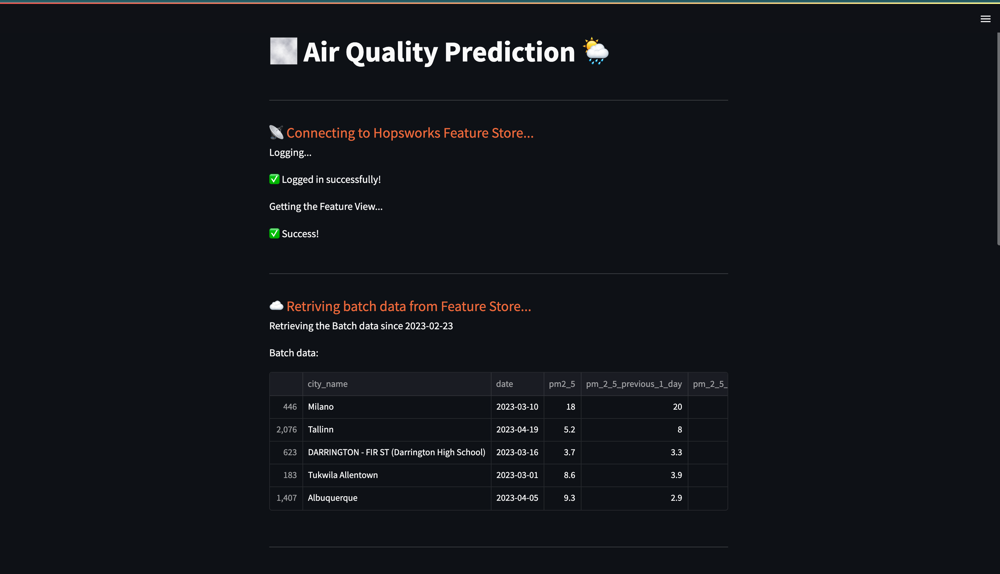
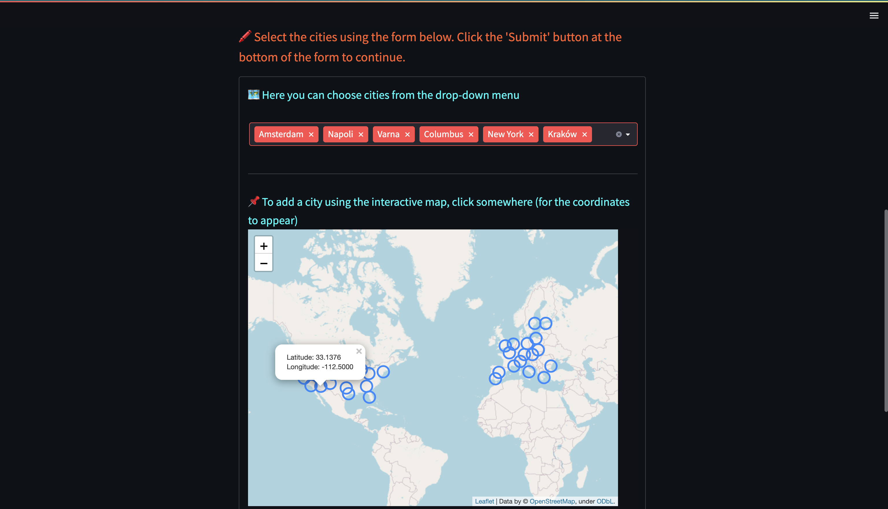
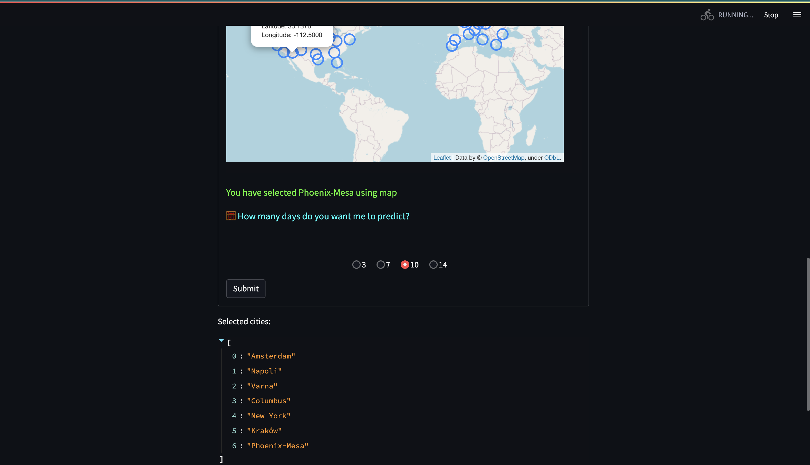
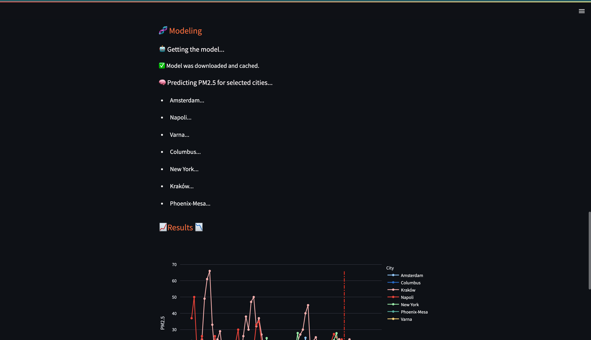
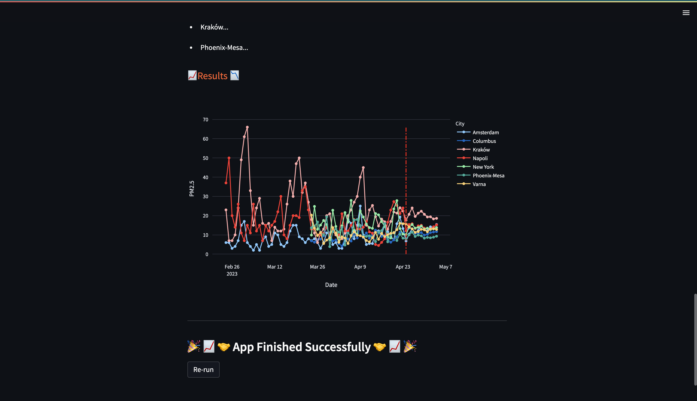
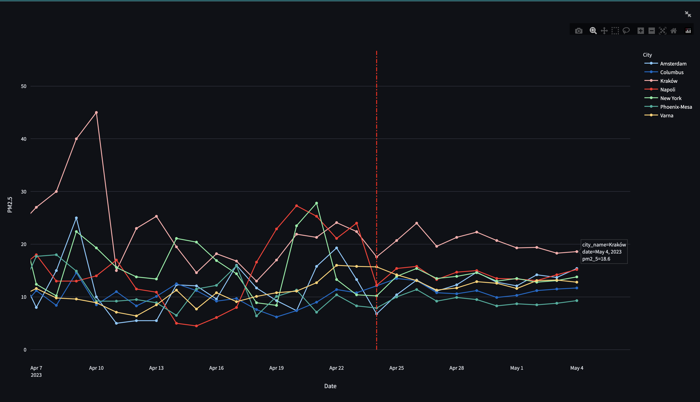

## Prerequisites
To run this tutorial, you need an account on Hopsworks. You can create a new account at  [app.hopsworks.ai](https://app.hopsworks.ai).
In the notebook you will be prompted with a link to generate an API token to interact with your Hopsworks account.

Also, you are required to have some python library installed (See the `requirements.txt` inside this folder).

## Data
The data for this project was collected using several different APIs. I used [European Environmental Agency](https://discomap.eea.europa.eu/map/fme/AirQualityExport.htm) to collect data on European cities, and [United States Environmental Protection Agency](https://aqs.epa.gov/aqsweb/documents/data_api.html#daily) for American cities.  Both are free and publicly available. They don't require registration or API keys. 
For the city of Seattle, I found and downloaded the data manually from [here](https://www.epa.gov/outdoor-air-quality-data/download-daily-data). 

In `feature pipeline` you will use a free [Open-Meteo](https://open-meteo.com/en/docs/air-quality-api) API that covers many places in the world (works by coordinates). 

The reason I use so many different APIs instead of just one Open-Meteo is that Open-Meteo only has data from 2022-07-29.

Anyway, as I said earlier, you don't need any registration or API keys to use any of the above APIs.

## Streamlit run
To run streamlit app (after you have run all notebooks and already have required feature groups in Feature Store and model in Model Registry), simply type:

`python -m streamlit run streamlit_app.py` on Windows

or

`python3 -m streamlit run streamlit_app.py` on Unix

## Streamlit usage examples

